# AndroidDSH

**English** | [中文](README.zh.md)

Run [DeepSeek Harness](https://github.com/deepseek-ai/deepseek-harness) (`dsh` — the
Cordis-based, plugin-driven agent runtime) natively on Android. This is **not a
reimplementation with an Android UI**: the app ships the real `dsh` and serves its
own native web frontend into a WebView.

> **Status: end-to-end working on a physical device** (Honor MAG-AN00 / arm64 /
> Android 16). The APK boots an embedded Node + `dsh --profile web`, and you get
> the genuine `dsh web` interface — sessions, trajectories, the tool-call tree,
> the sidebar, skills, goals — with the agent executing bash **locally on the
> device**.

```
$ ./scripts/install.sh phone        # build + install to a physical device
$ ./scripts/install.sh emulator     # build + install to an emulator
```

### Install a prebuilt APK

Both APKs on the
[Releases page](https://github.com/Windmill12/dsh-for-android/releases) are
**self-contained** — the Node runtime, DSH's dependency tree, bash, ripgrep and
CPython are all inside the package, so there is nothing else to install.

| File | For |
| --- | --- |
| `AndroidDSH-0.2.0-arm64-v8a.apk` | **Real phones** (almost all modern devices) |
| `AndroidDSH-0.2.0-x86_64.apk` | Android emulators (x86_64 images) |

```bash
adb install -r AndroidDSH-0.2.0-arm64-v8a.apk
```

Or copy the APK to the device and open it — you'll need to allow installing from
unknown sources. Check your download against the attached `SHA256SUMS.txt`.

Requires Android 8.0 (API 26) or newer, and ~600MB free for the install plus the
first-launch runtime unpack. On first launch the app asks for "All files access"
so the agent can work in `/sdcard/Documents/DSH`; decline it and the app falls
back to its private directory with no loss of functionality.

> The released APKs are **debug-signed**. Installing a future release over this
> one works fine, but an APK signed with a different key requires uninstalling
> first.

The launcher icon uses the official DSH mark (the path from
`dsh-web-frontend/dist/favicon.svg`) on brand blue `#4176e6` (read from the
running UI's `--dsw-static-deepseek-500`), as an adaptive icon, plus a 24dp white
silhouette for the notification shade.

| Launcher | Empty state | Session | Settings |
| --- | --- | --- | --- |
| 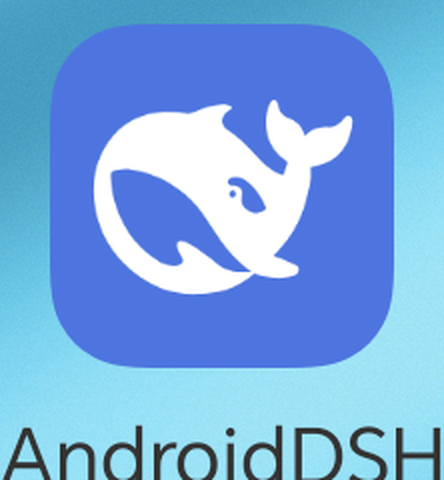 | 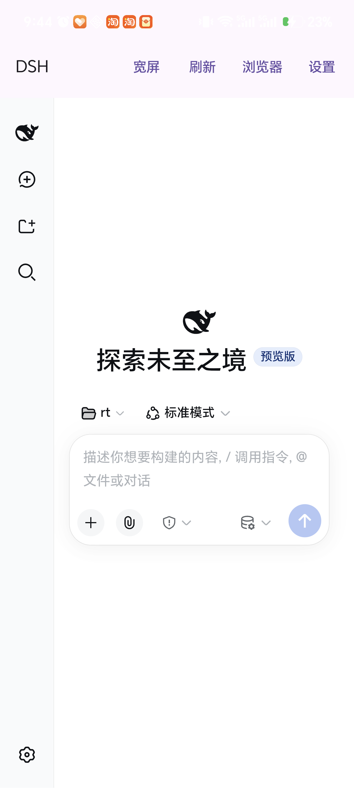 | 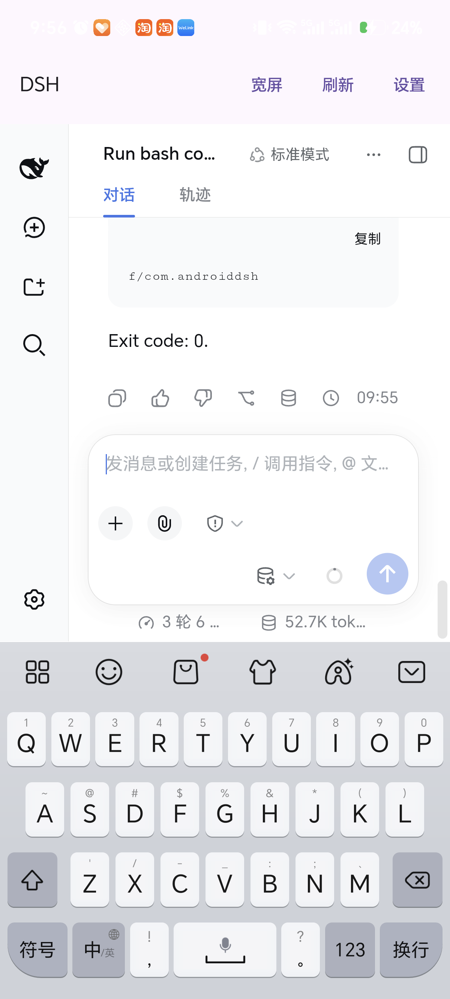 | 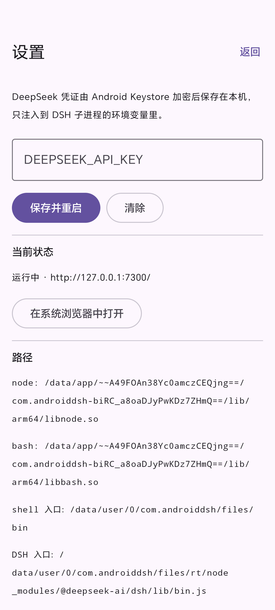 |

---

## Contents

- [Architecture](#architecture)
- [Notable Android pitfalls (all solved)](#notable-android-pitfalls-all-solved)
- [Building it](#building-it)
- [Installing and debugging](#installing-and-debugging)
- [Verified on hardware](#verified-on-hardware)
- [Known limitations](#known-limitations)
- [Development environment](#development-environment)
- [Network constraints](#network-constraints)
- [Version pinning](#version-pinning)

---

## Architecture

```
┌─ Android app (com.androiddsh) ─────────────────────────────────────────┐
│                                                                        │
│  MainActivity ──── Compose ──── WebView ◄── http://127.0.0.1:7300/?token=… │
│       │                              (DSH's native web frontend)        │
│       │ observes StateFlow                                             │
│  DshServerService (foreground service: keeps alive + persistent notice) │
│       │                                                                │
│  DshServer (singleton) ── ProcessBuilder ──► node --expose-internals …  │
│                                              bin.js --profile web --no-open │
│                                                                        │
│  assets/dsh-runtime.pkg    → filesDir/rt        (DSH's node_modules)   │
│  jniLibs/libnode.so        → nativeLibraryDir   (the Node binary)      │
│  jniLibs/libbash.so        → nativeLibraryDir   (static bash 5.2)      │
│  jniLibs/libripgrep.so     → nativeLibraryDir   (ripgrep; glob/grep)   │
│  jniLibs/libpython3.so     → nativeLibraryDir   (CPython 3.13)         │
│  assets/python-runtime.pkg → filesDir/python    (Python stdlib)        │
│  filesDir/home             → DSH's $HOME (profile / session / creds)   │
│  filesDir/bin              → symlinks to node / bash / rg / python3    │
│  /sdcard/Documents/DSH     → the agent's working directory (visible in │
│                              any file manager)                         │
└────────────────────────────────────────────────────────────────────────┘
```

**Why a WebView instead of rewriting the UI in Compose.** DSH's UI *is* a web
frontend built from roughly 60 client plugins (`dsh-web-frontend` +
`dsh-web-app`). Recreating it in Compose would mean reimplementing the entire
frontend and then trailing upstream forever. Running `dsh --profile web` and
pointing a WebView at it gives you the native interface, **identical to desktop
in every release**.

### Working directory: `/sdcard/Documents/DSH`

DSH uses the child process's `process.cwd()` as the default `workspaceRoot` for
new sessions, so the app simply sets node's cwd to `/sdcard/Documents/DSH` —
file managers, USB/MTP, and cloud sync all see the agent's output immediately.

That path **requires** `MANAGE_EXTERNAL_STORAGE` ("All files access"): SAF and
MediaStore hand apps Content URIs, which are meaningless to the embedded node
and bash subprocesses. Only real filesystem paths work. Without the permission
the app automatically falls back to the zero-permission
`Android/data/com.androiddsh/files/workspace` and everything still functions;
the settings screen has a "Grant access" button and the app restarts into the
public directory once you return.

Two things go with that:

- The first launch explains the permission once. It can also be granted from
  **Settings → Working directory → Grant access**.
- DSH's directory picker resolves to the **web-based server-side directory
  browser** on Android (the native picker only exists on darwin/win32/linux),
  and it starts from `os.homedir()` — i.e. `/data/user/0/<pkg>/files/home`,
  which takes many taps to escape. So `patch-dsh-android.py`'s
  `patch_picker_home()` makes it prefer `DSH_PICKER_HOME` (the app passes the
  working directory), which means the first "Select workspace" opens directly in
  `/sdcard/Documents/DSH` — one tap on **Open**.

---

## Notable Android pitfalls (all solved)

### 1. `link(2)` is globally blocked by SELinux

See `patch_session` / `patch_attachment` / `patch_fs_local` in
`scripts/patch-dsh-android.py`. DSH calls `fs.link()` in four places for
"exclusive publish" semantics, and on Android this is a flat `EACCES` (even in
the app's own private directory). Each is replaced by its semantic equivalent:
`open(to, "wx")` + `rename` when publishing a temp file, or + copy when
publishing an immutable alias. There is no race risk: DSH already holds an
exclusive flock on these paths.

### 2. `--expose-internals` is mandatory

The web profile mounts the HMR plugin, and startup fails outright without the
flag:

```
failed to apply loader entry (@deepseek-ai/cordis-plugin-hmr):
--expose-internals is required for HMR service
```

`dsh` does not pass this flag when it launches itself, so on Android the app has
to hand it to node explicitly. See `DshRuntime.webCommand()`.

### 3. No sandbox backend exists → every bash call is refused

The Android kernel has neither bubblewrap nor Landlock, while `dsh-base`
defaults to `sandbox-policy.mode = workspace-write`, so `tool-bash` reports:

```
sandbox mode "workspace-write" is requested but no sandbox backend is usable
on this host; refusing to run the command unconfined.
```

The fix requires no code changes: DSH already exposes the
`DSH_PERMISSION_MODE` seam (it drives both the sandbox mode and the approval
policy). The app sets it to `danger-full-access`, and
`SandboxBashExecutor.run()` takes the unsandboxed branch (the
`mode === "danger-full-access"` case in `dsh-bash-sandbox`).

### 4. Android has no bash — so we ship one

`tool-bash`'s executor hardcodes `spawn("bash", ["-c", cmd])`. Android only has
`/system/bin/sh` (mksh), and mksh lacks `pipefail`, arrays, `${v^^}`, etc., so
agent-written commands fail constantly.

- `scripts/build-bash-android.sh` cross-compiles **GNU bash 5.2.37** with the
  NDK (static, a single 1.6MB file), producing
  `.toolchain/build/bash-android-<arch>/bash`.
- Android only permits executing files from `nativeLibraryDir`, and AGP only
  packs `*.so` into `lib/<abi>/`, so it ships through jniLibs under the name
  **`libbash.so`** and lands at `<nativeLibraryDir>/libbash.so`.
- That absolute path reaches DSH through the `DSH_BASH_PATH` environment
  variable: `patch-dsh-android.py`'s `patch_bash_path()` replaces the hardcoded
  `"bash"` with `process.env.DSH_BASH_PATH ?? "bash"` in **both**
  `dsh-bash-local` and `dsh-bash-sandbox` (behaviour is identical to upstream
  when the variable is unset). Both must be patched: unsandboxed mode goes
  through the parent `LocalBashExecutor.run()`, sandboxed mode through
  `SandboxBashExecutor.confine()`, and patching only one leaves the other
  failing with `spawn bash ENOENT`.

### 5. `vh` / `dvh` all resolve to 0px inside the WebView (the subtlest one)

Measured on Android WebView 133.0.6943.137 (identical on emulator and hardware):

| Expression | Result |
| --- | --- |
| `window.innerHeight` | 712 ✅ |
| `visualViewport.height` | 712.4 ✅ |
| height of `position:fixed; inset:0` | 712 ✅ |
| `width:100vw` | 366 ✅ |
| **`height:100vh`** | **0px** ❌ |
| **`html{height:100%}` (ICB)** | **0px** ❌ |

This is not DSH's fault — a blank
`<style>html,body{height:100%}</style><div style="height:100vh">` page behaves
the same way in that WebView. Every combination of `useWideViewPort` /
`loadWithOverviewMode` fails to help.

The consequence: DSH's frontend rule
`html,body,#root{height:100%}` collapses to 0 all the way down, leaving only a
`position:fixed` modal overlay — which looks like **a white screen with a grey
scrim**. The frontend also uses `vh` in 13 other files (the welcome modal's
`max-height`, dropdowns, cards, the code viewer, the right-hand panels).

The fix is `VIEWPORT_SHIM_JS` in `DshWebView.kt`: an injected script that
**probes first** — on healthy devices it does nothing at all — and when vh is
broken does two things:

1. Pins `html` / `body` / `#root` heights to `innerHeight` pixels;
2. Walks every stylesheet and rewrites `n vh` into
   `calc(var(--dsh-vh) * n / 100)`, with `--dsh-vh` maintained from
   `innerHeight` by the same script.

A `MutationObserver` (client plugin styles are injected as `<style>` at runtime)
plus `resize` / `visualViewport.resize` (soft keyboard, rotation) keep it in
sync.

### 6. The soft keyboard covers the input box

targetSdk 35+ enforces edge-to-edge, so the window is no longer pushed up by the
IME. Fix: `android:windowSoftInputMode="adjustResize"` plus
`Modifier.imePadding()` on the Compose side.

### 7. The ripgrep backend behind `glob` / `grep` does not exist on Android

`glob` / `grep` are driven by `dsh-tool-fs-search`, which looks for a ripgrep
binary along two paths — and on Android **neither works**:

1. The `` `${process.execPath}-rg` `` sidecar, used only in the one branch
   guarded by `"pkg" in process` (single-file runtimes); and AGP only packs
   `*.so` from jniLibs into `lib/<abi>/` — I verified that dropping a
   `libnode.so-rg` into jniLibs gets **silently discarded**, the file simply
   isn't in the APK;
2. The `@vscode/ripgrep` platform packages — which cover linux/mac/win, not
   Android.

The symptom is
`glob could not start its search command (ripgrep launch failed)`.

The fix follows the bash playbook: `scripts/build-ripgrep-android.sh`
cross-compiles **ripgrep 15.2.0** (Rust 1.98.1, `--features pcre2`, with PCRE2
10.45 statically linked), ships it as `libripgrep.so`, and
`patch-dsh-android.py`'s `patch_rg_path()` reads `DSH_RG_PATH` to point at it.
Verified: `rg --version` reports `features:+pcre2` and `-P` lookbehind works.

### 8. Along the way: `python3`

`scripts/build-python-android.sh` cross-compiles **CPython 3.13.15** (a PIE
executable built `--disable-shared`; `readelf -d` shows only
`libdl/libz/libm/liblog/libc`; OpenSSL 3.0.16, libffi, liblzma, libbz2,
sqlite 3.46.1, readline 8.2 and ncurses 6.5 are all statically absorbed into
their extension modules). The interpreter ships as `libpython3.so`, and the
standard library (including 58 `lib-dynload/*.so` files) goes out as
`assets/python-runtime.pkg`, unpacked to `filesDir/python` with `PYTHONHOME`
pointed at it.

Verified working: `python3 -m pip` (26.2.1), `sqlite3`, `ssl`, `hashlib`,
`ctypes`, `zlib`, `lzma`, `bz2`, `readline`, `socket`, `threading`,
`subprocess`, `multiprocessing.Process` (fork).

Two things are impossible and both are hard platform limits, not build
failures:

- `_posixshmem` is missing — the device's `libc.so` has no `shm_open` at all;
- `multiprocessing.Pool` / `Lock` / `Semaphore` fail with `ENOSYS` — the
  Android kernel does not support POSIX named semaphores. `Process` / `fork` are
  fine.

The 14 bionic cross-compilation traps (`ac_cv_kthread` polluting CC, bionic
hiding `getrandom` behind API 28, OpenSSL's `-static` implying `no-threads`,
readline 8.2 no longer bundling termcap, `LDSHARED` omitting `LIBS` which leaves
`_sqlite3.so` with undefined symbols, ctypes assuming libpython is a shared
library on Android, …) are all documented in the header comment of
`scripts/build-python-android.sh`.

### 9. DSH 0.2.0's new prebuilt-only dependency (`node-addon-require-builtin`)

Since 0.2.0, `dsh-app-boot` does `require("node-addon-require-builtin")` very
early during startup to reach Node's internal modules. That package **ships
prebuilt binaries only**: no `src/`, no `binding.gyp`, and the optional packages
on npm cover only nine darwin/linux/win32 targets — **no android**. All three of
its loader paths come up empty, so it fails fatally:

```
dsh: host preparation failed: No usable native binding found
     for node-addon-require-builtin-android-arm64 (auto)
```

But the "optional package" path goes through a plain `require()`, and the
loader's entire requirement of a binding is three functions —
`requireBuiltin` / `isAllowedInternalId` / `getNativeBindingInfo` — where the
last must return `{mode, product, backend, abi}` with `product` equal to
`require-builtin`. **A pure-JS package can stand in.** See
`step_require_builtin()` in `prepare-dsh-android.sh`, which generates
`node-addon-require-builtin-android-{arm64,x64}`.

This works because we already launch with `--expose-internals` (pitfall #2):
with that flag, `require("internal/modules/esm/loader")` works from an ordinary
CJS module, so the very thing the real addon does — "reach internal bindings
without the flag" — is already accomplished by the flag, and the shim only
forwards. Not compiling the real C++ is deliberate: that would mean wiring into
Node's internal binding table from C++, which is expensive and drifts with every
Node version, and it buys us nothing in this configuration.

### 10. The settings screen collapses into a column of single characters on narrow screens

DSH's web frontend **has no width breakpoints at all**. The settings overlay is
a fixed two-column "188px left nav + right content" layout, so at 366 CSS px in
phone mode the content column is only about 130px wide and every character has
to stack vertically.

Two layers of fix:

- **Wide mode genuinely widens the layout viewport** (`applyViewportWidth`).
  Note that CSS `zoom` **must not** be used: Blink computes the containing block
  of `position:fixed` elements from the *visual* viewport width, so zoom only
  scales the result down — the zoom version makes the fixed-position settings
  overlay **worse** (content column 130px → 81px). The right approach is to
  change the `<meta viewport>` to `width=720`, and let `loadWithOverviewMode`
  scale the whole page to the screen (measured `visualViewport.scale = 0.509`,
  content column 484px).
- **A narrow-screen fallback CSS**: under `@media (max-width: 700px)` the
  settings nav becomes a horizontal tab strip and the content takes the full
  width. All selectors are semantic/structural
  (`[role="dialog"][aria-modal="true"]:has(> nav)`), depending on **not a single
  hashed CSS-module class name**.

### 11. Terminal panel: the default shell is mksh, and the app's private dir forbids exec

DSH's sidebar ships a terminal (`dsh-api-terminal-controller` +
`ui-sidebar-terminal`), which has to clear two hurdles on Android:

**Hurdle one: shell selection.** The default in
`dsh-subprocess-local.terminalEnvironment()` is
`process.env.SHELL || userInfo().shell || "/bin/sh"`. On Android `userInfo()`
has no shell field and `/bin/sh` is mksh — weak syntax (no pipefail / arrays /
`${v^^}`) and it won't read our convenience commands. The fix needs no patch:
point `SHELL` at the bundled bash.

**Hurdle two: convenience commands in `~/.bashrc`.** The intuitive way to add
`pnpm` / `dsh` commands to the terminal is wrapper scripts in `files/bin/` —
**but Android's app private directory forbids exec**:

```
$ /data/user/0/com.androiddsh/files/bin/t.sh
/system/bin/sh: bad interpreter: Permission denied   (exit 126)
```

Only symlinks pointing into `nativeLibraryDir` are executable (that directory
isn't mounted `noexec`). So the only option is shell functions that point
commands at `node <js entry>`, written into `~/.bashrc` (read by bash) and
`~/.dshrc` (read by mksh/toybox sh via `$ENV`).

> When testing this: running a script via `adb shell run-as <pkg> ...` will
> **succeed**, because that only switches uid and the SELinux domain stays
> `shell`, whose rules differ from the app domain (`untrusted_app`). To verify
> it properly you must run from the app's own process (e.g. have the agent call
> the bash tool).

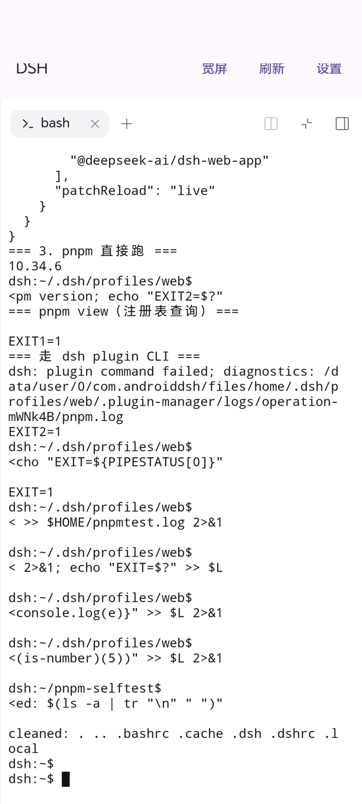

### 12. Installing plugins: `ANDROIDDSH_PNPM_ENTRY`

Installing a plugin in DSH (both the UI's "Add plugin" and `dsh plugin add`)
delegates to pnpm. Two obstacles on Android:

1. pnpm's bin is a script and **cannot be exec'd** (see the previous item).
2. **Since pnpm 12 pnpm is a native binary** (`bin/pnpm.mjs` is just a shim that
   downloads the binary), and there is no Android build. So what ships is the
   pure-JS **pnpm 10.x** (`bin/pnpm.cjs`, 23MB unpacked).

The solution is to forward at pnpm's call sites: `execa(options.command ?? "pnpm", [...])`
is rewritten to `execa(...androidPnpmLaunchArgs(options, [...]))`, which uses
`node <pnpm.cjs>` when `ANDROIDDSH_PNPM_ENTRY` is set. Two things are worth
recording:

- **Both implementations must be covered.** The server
  (`dsh-plugin-manager/lib/index.js`) and the CLI (the same package's
  `lib/types/operations.js`) each have their own copy with 5 `execa` calls
  apiece. Patching only the server means running `dsh plugin ...` in the
  terminal reports `dsh: pnpm was not found` (exit 127).
- **`DSH_*` variables do not reach child processes.** DSH launches subprocesses
  through `scrubbedParentEnv()`, which strips every `DSH_*` variable. They exist
  in the server process but not in the terminal's shell, so `~/.bashrc` has to
  `export ANDROIDDSH_PNPM_ENTRY` again.

**Known limitation:** pnpm 10.34 forwards a subset of subcommands **to real
npm** (`view` / `info` / `search` / `whoami` / `ping` …, see `passThruToNpm` in
dist), and we ship no npm — so those exit 1 silently.

The good news is that **`add` / `install` / `remove` are not in the forwarding
list** and use pnpm's own implementation — I verified `pnpm add is-number` in a
temp directory completes the whole flow (resolved → downloaded → added, exit 0),
and that is exactly the command plugin installation uses. What is affected is
DSH's pre-install "registry pre-query" (`pnpm view`), and when that fails DSH
treats it as "not found" and continues, so it doesn't block installation. To
close the gap completely you could ship a copy of npm and apply the same
forwarding to pnpm's `runNpm`.

### 13. Plugin compatibility gate and the install flow

Before installing a plugin, DSH reads its `peerDependencies`. If the declared
`@deepseek-ai/dsh-*` ranges do **not** cover the current runtime version, it
refuses and rolls back:

```
dsh: installation rejected: Plugin dsh-archive-manager@1.1.1 is incompatible with
     dsh 0.2.0-rc.2: peerDependencies {"@deepseek-ai/dsh-agent":"^0.1.0-rc.6", ...}
dsh: restored package.json, pnpm-lock.yaml, and node_modules.
```

**This is not a platform issue** — pnpm already downloaded and installed
everything successfully; DSH itself reverted it. So seeing this message means
the porting layer is working perfectly. To judge whether a plugin will work,
check whether its peers include the current version. For example
`@michengai/dsh-archive-manager@1.0.11` lists every package as
`0.1.2-rc.1 || … || 0.2.0-rc.1 || 0.2.0-rc.2`, so it passes the gate directly.

If you really need a version declared incompatible, DSH provides an escape hatch
(**it can genuinely crash — use with care**):

```sh
dsh plugin --profile web allow-version <pkg@version> --dsh-version 0.2.0-rc.2 --accept-risk
```

**Install flow** (from the terminal; restart afterwards):

```sh
dsh plugin --profile web add <pkg>     # install
# restart the app (so the plugin takes effect as a profile bundle)
dsh plugin --profile web remove <pkg>  # remove
dsh plugin --profile web version-exemptions   # list granted exemptions
```

Once installed, the profile's `package.json` records the plugin as a bundle:

```json
"dsh": { "profile": { "bundles": [
    "@deepseek-ai/dsh-base", "@deepseek-ai/dsh-web-app", "@michengai/dsh-archive-manager"
], "patchReload": "live" } }
```

**A trap in the host compiler:** `~/.dsh/profiles/node_modules` is where plugins
resolve `@deepseek-ai/dsh-*` from (240 packages). After a runtime upgrade DSH
refreshes it along with everything else, so both sides stay in sync (measured:
all 0.2.0-rc.2). But the web profile's own `pnpm-workspace.yaml` sets
`autoInstallPeers: false`, so installing a plugin makes pnpm emit a pile of
`✕ missing peer` warnings — **that is expected**, resolution happens at the
profile layer and functionality is unaffected.

Plugins verified working against 0.2.0-rc.2 (peer ranges explicitly cover
`0.2.0-rc.2`):

| Plugin | What it does |
| --- | --- |
| `@michengai/dsh-archive-manager` | Archived-session management: group by workspace, search titles and bodies, bulk restore/delete, favourites, idle cleanup (entry at **Settings → Archived sessions**) |
| `@linxin666/dsh-session-archive` | Archive manifest, bulk archive/restore, cascading hard delete |
| `dsh-session-steward` | Session steward (claims a 0.2.0-specific track): archive browsing/cleanup + session health checks |
| `dsh-chat-manager` | Session history management: search archives, restore, safe delete |
| `dshmarket` | **Visual plugin marketplace**: browse, search and one-click install community plugins from inside DSH |

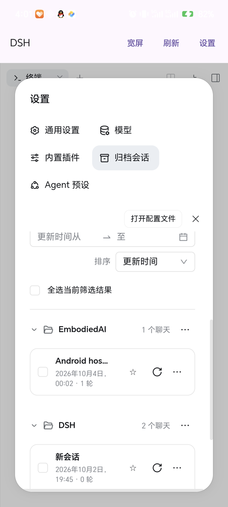

The community plugin marketplace `dsh-market` (`v1.66.8`) browsing, searching and
one-click installing on real hardware:

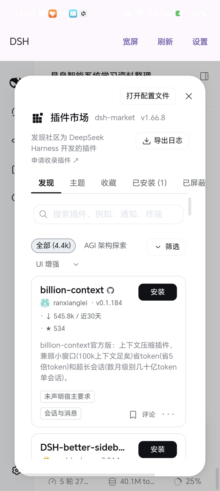

### 14. pnpm forwarding to npm: why the UI's "Add plugin" failed

Installing via the UI's "Add plugin" failed with:

```
无法获取插件信息: pnpm view exited with 1
("Could not fetch plugin info: pnpm view exited with 1")
```

This is not a porting problem but **pnpm 10.34 forwarding a batch of
subcommands to real npm** (`passThruToNpm` in `dist/pnpm.cjs`:
`view`/`info`/`search`/`whoami`/`ping`/`version` …). There is no npm on Android,
so `runNpm()` spawns `npm` and silently exits 1.

The fix is two steps:

1. **Ship a copy of npm** (pure JS, 19MB, entry `bin/npm-cli.js`).
2. **Rewrite pnpm's `runNpm()`** to replace `npm` with `node <npm-cli.js>`:

```js
const npmEntry = process.env.ANDROIDDSH_NPM_ENTRY;
const npm = npmEntry !== void 0 && npmEntry !== "" ? process.execPath : npmPath ?? "npm";
return runScriptSync(npm, npmEntry !== void 0 && npmEntry !== "" ? [npmEntry, ...args] : args, { … });
```

`add` / `install` / `remove` were never in the forwarding list (they use pnpm's
own implementation), so this fix only affects the query subcommands — but the
UI's pre-install query is exactly what depends on them.

### 15. jsrun: making `pnpm` a genuinely executable command

Some tools look up a `pnpm` **executable** on PATH (dsh-market does: it spawns
`pnpm --version` and otherwise reports "you need to configure a pnpm
environment"), and shell functions can't help them.

But the app's private directory forbids exec (pitfall #11), so "node + JS entry"
can't be turned into a wrapper script. So the repo adds `native/jsrun.c` — a
launcher a few dozen lines long:

- Compiled with the NDK into `libpnpm.so` / `libpnpx.so` / `libnpm.so` and placed
  in jniLibs;
- `ensureExecShims()` creates same-named symlinks in `files/bin/` (symlinks
  point into nativeLibraryDir, hence executable);
- The launcher itself `execv("…/libnode.so", [node, <JS entry>, …args verbatim])`.

Node's path is derived from `/proc/self/exe` (its sibling in the same
directory); the JS entry is read from an environment variable first
(`ANDROIDDSH_PNPM_ENTRY` etc.), falling back to a compile-time constant. The
launcher can't run on the host, so it's designed to depend on little beyond
bionic — 8KB after compilation.

> Why a separate `.so` per command: `/proc/self/exe` gives the target **after
> symlink resolution**, so it can't tell which name it was invoked as. Three 8KB
> files don't matter.

### 16. Two "installed but won't start" traps

**Trap A: after changing the runtime, `RUNTIME_VERSION` must be bumped.** The
app uses it to decide whether to re-unpack the runtime. Once a bad package was
installed (version 10 already marked as unpacked); after fixing it, it was
installed **without bumping the version** — the app decided no re-unpack was
needed, the device still had the bad copy, and so "it was fixed but still
wouldn't start". Always `RUNTIME_VERSION += 1` after changing runtime contents.

**Trap B: running `npm install` inside staging wipes Android-specific
artifacts.** Running `npm install` once to add an npm dependency made npm treat
packages not listed in `package.json` as cruft and delete them:

```
node-addon-require-builtin-android-{arm64,x64}   ← the require-builtin shim
@koromix/koffi-android-{arm64,x64}
@deepseek-ai/node-addon-system-android-{arm64,x64}
```

Only node-pty survived (it writes into its own `prebuilds/`). The symptom of
their absence is a startup error —
`No usable native binding found for node-addon-require-builtin-android-arm64` —
which is a long way from the cause. **After adding a dependency, re-run both
architectures of `prepare-dsh-android.sh`**; `prepare-app-assets.sh` now also
hard-validates these 8 artifacts and exits with an error if any is missing.

---

## Building it

Everything is built inside the workspace; nothing depends on the system package
manager. The whole toolchain lives in `.toolchain/` (about 26GB, excluded by
`.gitignore`).

### 0. Prerequisites

- Linux x86_64 host (the scripts assume `linux-x86_64` NDK prebuilts).
- `curl`, `unzip`, `tar`, `python3`, `git`, and a C toolchain for host build
  tools (`gcc`/`make`) — needed by the Node, bash, Python and Rust builds.
- Roughly **40GB of free disk space** and a lot of patience: the first full
  build is measured in hours, dominated by two architectures of Node.
- Roughly 4GB RAM available to Gradle (`org.gradle.jvmargs=-Xmx4g`).

This repository is **source-only**: the prebuilt runtime inputs
(`app/src/main/assets/*.pkg` and `app/src/main/jniLibs/`, ~398MB) are
deliberately not committed, because they are build outputs and would bloat the
repo badly. You must produce them yourself with the steps below. If you only
want to *use* the app, download a ready APK from the
[Releases page](https://github.com/Windmill12/dsh-for-android/releases) instead —
those are self-contained.

### 1. Bootstrap the toolchain

```bash
source scripts/env.sh              # exports JAVA_HOME / ANDROID_HOME / PATH / DSH_GRADLE
./scripts/bootstrap-toolchain.sh   # JDK 21 (Temurin) + Android cmdline-tools
./scripts/install-sdk-packages.sh  # platform 36, build-tools 36.1.0, NDK r29, emulator
```

`scripts/env.sh` also points everything at domestic mirrors (see
[Network constraints](#network-constraints)); if you are outside mainland China
you may want to replace those with the upstream URLs at the top of
`scripts/env.sh` and `settings.gradle.kts`.

Optionally create the emulator AVD used during development (Pixel 7 / API 36 /
x86_64, named `dsh_x86_64`):

```bash
sdkmanager "system-images;android-36;google_apis;x86_64"
avdmanager create avd -n dsh_x86_64 -k "system-images;android-36;google_apis;x86_64" -d pixel_7
emulator -avd dsh_x86_64
```

### 2. Cross-compile the native payloads

Each script takes an architecture (`arm64` for real devices, `x86_64` for
emulators) or `all` for both. Re-running any of them is safe and idempotent, and
they cache their sources under `.toolchain/downloads`.

```bash
# Node 22.23.3 — by far the longest step, roughly 40 minutes per ABI
./scripts/build-node-android.sh all

# GNU bash 5.2.37 (static) — about 1 minute per ABI
./scripts/build-bash-android.sh all

# ripgrep 15.2.0 + static PCRE2 — about 1 minute per ABI (installs Rust on first run)
./scripts/build-ripgrep-android.sh all

# CPython 3.13.15 — about 15 minutes per ABI
./scripts/build-python-android.sh all

# jsrun launcher (libpnpm.so / libpnpx.so / libnpm.so) — seconds
./scripts/build-jsrun-android.sh all
```

Node is the one that will bite you: it **must be ≥ 22.18** (see
[Version pinning](#version-pinning)), and the build script applies two mandatory
Android patches automatically and idempotently via `apply_android_patches()`:

1. **`deps/uv/src/unix/linux.c`: `LLONG_MAX` → `INT64_MAX`** — Node compiles C
   sources with `--std=gnu89` and `LLONG_MAX` is C99. glibc exposes it because
   of `_GNU_SOURCE`; bionic does not.
2. **`deps/v8/src/trap-handler/trap-handler.h`: force
   `V8_TRAP_HANDLER_SUPPORTED false`** — in `v8.gyp` the trap-handler sources
   are conditional on `OS in (linux, mac, ios, freebsd)` — which **excludes
   android**. When cross-compiling, `OS=android` globally, yet the host-side
   mksnapshot still decides the trap handler is available, so linking fails with
   `undefined symbol: TryHandleSignal`.

The bash build has its own set of traps, documented in the header comment of
`scripts/build-bash-android.sh`; the essentials are
`--without-bash-malloc` (Android's `sbrk` is a dead stub),
`ac_cv_func_faccessat=no` (bionic's `faccessat(AT_EACCESS)` returns EINVAL,
which makes `test -x` report false for every file),
`ac_cv_func_getrandom=no` (the NDK headers hide the declaration below API 28 but
configure's link probe passes, so clang then reports it undeclared),
`bash_cv_termcap_lib=gnutermcap` (don't link the host's libtinfo),
`CC_FOR_BUILD=gcc` (build-time tools need the host compiler), and
`LDFLAGS=-static` (`--enable-static-link` doesn't actually add `-static` on
Linux).

### 3. Fetch the DSH runtime and adapt it to Android

Install DSH's dependency tree somewhere outside the repo (any directory will
do), then run the adaptation for **both** architectures:

```bash
# Example: materialize DSH 0.2.0-rc.2's dependency tree
mkdir -p /tmp/dsh-runtime && cd /tmp/dsh-runtime
npm init -y
npm install @deepseek-ai/dsh@0.2.0-rc.2

# Adapt it: koffi / node-pty / flock native modules + the link(2) patches
./scripts/prepare-dsh-android.sh /tmp/dsh-runtime/node_modules x86_64
./scripts/prepare-dsh-android.sh /tmp/dsh-runtime/node_modules arm64
```

`prepare-dsh-android.sh` handles every native-dependency problem DSH hits on
Android:

1. **koffi** — an FFI library; official Android prebuilds exist, installed
   directly.
2. **node-pty** — pseudo-terminals; ships sources, cross-compiled with the NDK.
3. **flock** — the native module from `@deepseek-ai/node-addon-system`, which
   ships `src/flock.c`.
4. **Hard links** — Android SELinux globally forbids `link(2)`; 4 call sites are
   patched.
5. **`require-builtin` shim** — generates the pure-JS
   `node-addon-require-builtin-android-{arm64,x64}` stand-in (pitfall #9).

All steps are idempotent.

Then assemble everything into the app:

```bash
./scripts/prepare-app-assets.sh /tmp/dsh-runtime/node_modules
```

This produces, inside the source tree:

```
app/src/main/jniLibs/<abi>/libnode.so          # Node executable
app/src/main/jniLibs/<abi>/libc++_shared.so    # C++ runtime Node needs
app/src/main/jniLibs/<abi>/libbash.so          # static bash
app/src/main/jniLibs/<abi>/libripgrep.so       # ripgrep
app/src/main/jniLibs/<abi>/libpython3.so       # CPython
app/src/main/jniLibs/<abi>/lib{pnpm,pnpx,npm}.so  # jsrun launchers
app/src/main/assets/dsh-runtime.pkg            # DSH's node_modules (tar.gz)
app/src/main/assets/python-runtime.pkg         # Python stdlib (tar.gz)
```

The script hard-validates the 8 Android-specific artifacts mentioned in trap B
and exits with an error if any is missing — if you see that error, re-run step 3
for both architectures.

> **After changing anything in the runtime, bump `RUNTIME_VERSION` in
> `DshRuntime.kt`** (trap A).

### 4. Package the APKs

There is no Gradle wrapper checked in; use the Gradle distribution from
`.toolchain` (via `source scripts/env.sh`):

```bash
source scripts/env.sh
$DSH_GRADLE :app:assembleDebug
```

The output is two ABI-split APKs at
`app/build/outputs/apk/debug/app-<abi>-debug.apk`.

**If you want to keep a build, look in `dist/`** — `install.sh` copies the
artifacts there and gives them a stable versioned name on every build
(`build/` gets wiped by `gradle clean`):

```
dist/AndroidDSH-0.2.0-arm64-v8a.apk     # real devices (~277MB)
dist/AndroidDSH-0.2.0-x86_64.apk        # emulators    (~243MB)
dist/SHA256SUMS.txt
```

The paths under `app/build/` are overwritten by every `assembleDebug`.

### Build from scratch, condensed

```bash
source scripts/env.sh
./scripts/bootstrap-toolchain.sh
./scripts/install-sdk-packages.sh
./scripts/build-node-android.sh all           # ~40 min / ABI
./scripts/build-bash-android.sh all           # ~1 min  / ABI
./scripts/build-ripgrep-android.sh all        # ~1 min  / ABI
./scripts/build-python-android.sh all         # ~15 min / ABI
./scripts/build-jsrun-android.sh all          # seconds

./scripts/prepare-dsh-android.sh /tmp/dsh-runtime/node_modules x86_64
./scripts/prepare-dsh-android.sh /tmp/dsh-runtime/node_modules arm64
./scripts/prepare-app-assets.sh  /tmp/dsh-runtime/node_modules

$DSH_GRADLE :app:assembleDebug
```

---

## Installing and debugging

```bash
./scripts/install.sh phone      # or emulator / all / <serial>
```

`install.sh` builds, picks the APK matching the device ABI, installs it, grants
`MANAGE_EXTERNAL_STORAGE` via `appops` (a development convenience; for real
distribution the user grants it themselves from the first-launch prompt), then
launches the app and waits for the node process to come up.

The manual equivalent:

```bash
adb -s <serial> install -r -d app/build/outputs/apk/debug/app-<abi>-debug.apk
adb -s <serial> shell appops set com.androiddsh MANAGE_EXTERNAL_STORAGE allow
adb -s <serial> shell am start -n com.androiddsh/.MainActivity
adb -s <serial> logcat -s DshServer DshWeb          # service + WebView console
```

To install a prebuilt APK on another phone:

```bash
adb install -r -d dist/AndroidDSH-<version>-arm64-v8a.apk
```

Most phones are arm64. Debug APKs are signed with the host's
`~/.android/debug.keystore`, so later builds install as upgrades over each
other; an APK signed with a different key must be uninstalled first.

Debug builds enable `WebView.setWebContentsDebuggingEnabled(true)`, so you can
attach DevTools and inspect the real DOM:

```bash
SOCK=$(adb shell cat /proc/net/unix | grep -o 'webview_devtools_remote[^ ]*' | head -1)
adb forward tcp:9222 localabstract:$SOCK
curl -s http://127.0.0.1:9222/json
```

---

## Verified on hardware

Honor MAG-AN00 / arm64 / Android 16:

| Item | Result |
| --- | --- |
| Bundled DSH version | **0.2.0-rc.2** ✅ |
| Bundled `node -v` | `v22.23.3` ✅ |
| Bundled `bash --version` | `GNU bash, version 5.2.37(1)-release (aarch64-unknown-linux-android)` ✅ |
| `dsh --profile web` startup | prints `dsh web: http://127.0.0.1:7300/?token=…` ✅ |
| DSH native web UI | sessions / trajectories / tool tree / sidebar / settings all usable ✅ |
| Agent runs bash | `which node` → `files/bin/node`; `pwd`, writing files, `cat`-ing them back all succeed ✅ |
| Working directory | `pwd` → `/storage/emulated/0/Documents/DSH`; a `hello-dsh.txt` written by the agent is directly visible from `adb shell` / file managers ✅ |
| Directory picker | opens directly at `/sdcard/Documents/DSH` (`DSH_PICKER_HOME`), one tap on "Open" finishes selection ✅ |
| `glob` / `grep` tools | ripgrep 15.2.0 (`features:+pcre2`) works; exit codes 0/1/2 correct ✅ |
| Agent runs python | `python3` = CPython 3.13.15; `python3 -m pip` = 26.2.1; `sqlite3`/`ssl` (OpenSSL 3.0.16)/`ctypes`/`zlib`/`hashlib` all work ✅ |
| Regression after the 0.2.0 upgrade | bash / glob / python3 all exit 0; the `require-builtin` shim works; old session history migrated intact ✅ |
| Terminal panel | default shell = bundled bash 5.2; `pnpm --version` → 10.34.6 and `dsh -V` → 0.2.0-rc.2 both callable directly ✅ |
| Plugin installation | npm ships in the package, so pnpm's query subcommands (`view`/`search`) now work; the full `pnpm add` flow works ✅ |
| GUI plugin installation | DSH's built-in "Add plugin" and the `dsh-market` plugin marketplace can both query and install ✅ |
| Terminal and commands | bundled bash 5.2; `pnpm`/`npm`/`npx`/`dsh` are all real executables in `files/bin` ✅ |
| Wide mode | layout viewport 720 CSS px, `visualViewport.scale=0.509`; settings content column 484px (318px in phone mode) ✅ |
| Foreground service | the agent keeps running after backgrounding; one-tap stop from the notification ✅ |
| API key | stored encrypted by the Android Keystore (AES-GCM); it can also be entered in DSH's onboarding flow ✅ |

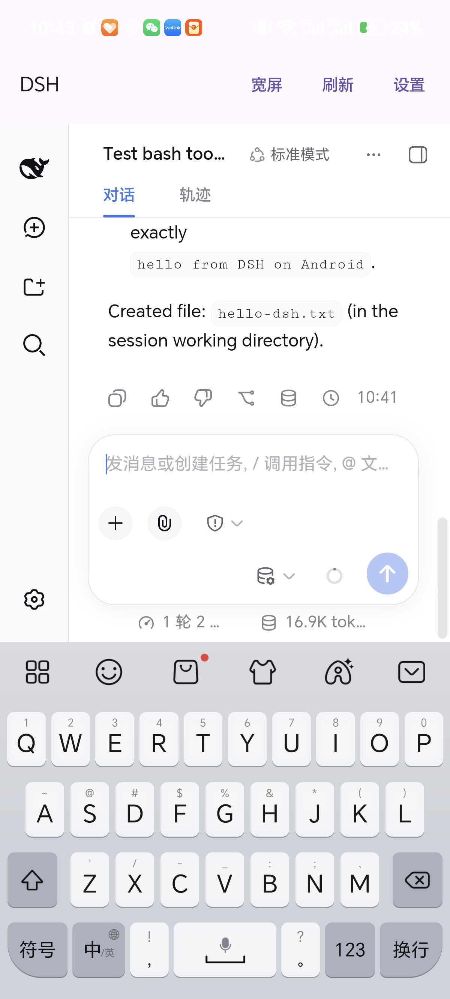

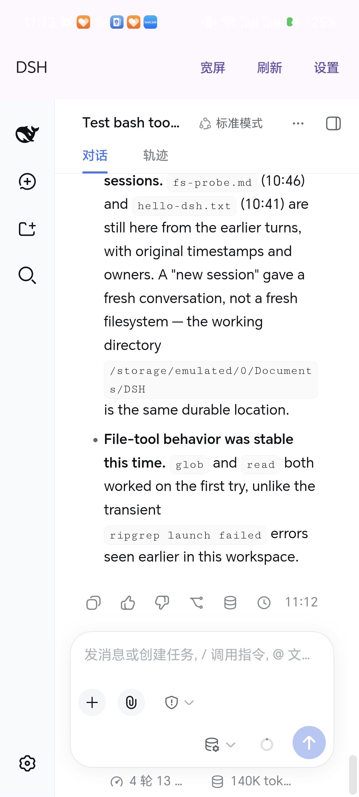

Settings screen in both modes (left: wide, 720 CSS px, content column 484px;
right: phone, 366 CSS px, content column 318px after the nav becomes a
horizontal tab strip):

| Wide | Phone |
| --- | --- |
| 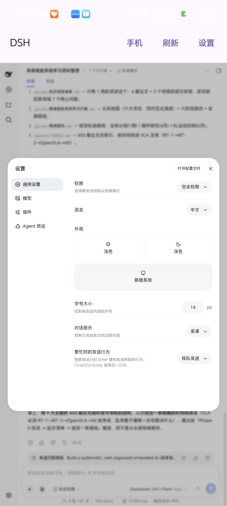 | 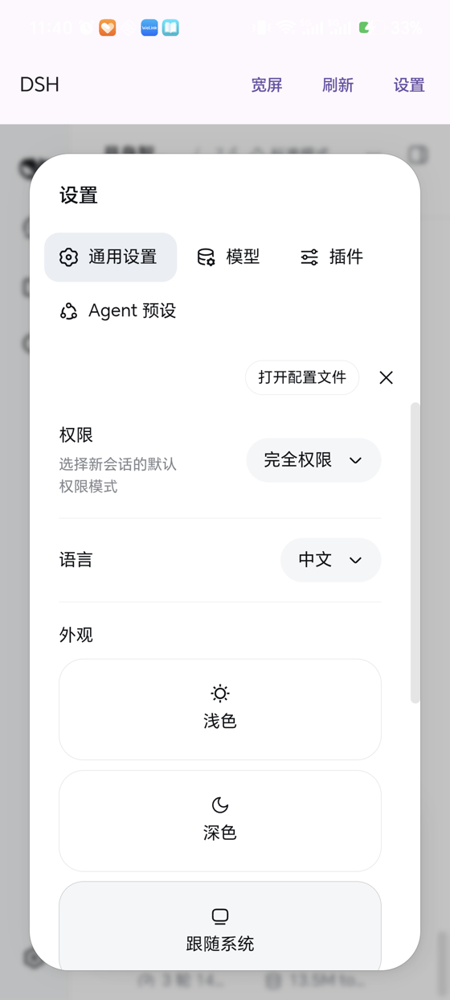 |

---

## Known limitations

1. **No `git`.** Android doesn't ship git, so the agent can't run
   `git status/diff/commit`. To use it as a real coding agent you'd have to
   cross-compile git (zlib/openssl/curl dependencies — far more work than bash)
   or borrow Termux's prefix.
2. **The `npm install` ecosystem is incomplete.** `node` and `python3` work, but
   there's no `git` and no C toolchain, so packages that need compilation
   (including `pip install` with C extensions) can't be installed. Pure
   Python/pure JS packages are fine.
3. **Model credentials have only two paths: env and DSH's own store.** The app's
   Keystore storage exists so things work even without DSH's onboarding flow. If
   both are set, **the environment variable wins** (DSH's layering rules).
4. **`MANAGE_EXTERNAL_STORAGE` is a sensitive permission.** For self-signed /
   sideloaded builds it's irrelevant; publishing to Google Play requires a
   separate declaration and will very likely be rejected (that permission is
   only open to file managers, backup, and antivirus apps).
5. **16KB alignment**: the Node binary is already 16KB-aligned (see below);
   `libbash.so` / `libripgrep.so` / `libpython3.so` are executables that are
   static or depend only on system libraries, and `readelf -l` shows their LOAD
   segments are 16KB-aligned.
6. **ncurses has no terminfo database.** Android has no
   `/system/usr/share/terminfo`, so Python's `readline` can only fall back to
   the built-in `dumb` entry. The agent runs non-interactive commands, so this
   doesn't matter; a genuinely interactive terminal would need a bundled
   terminfo directory and `TERMINFO` set.
7. **`adb install` payloads are roughly 230–260MB** (debug, unobfuscated; DSH
   0.2.0's node_modules alone is 122MB). Enabling R8 and keeping a single ABI
   would cut this considerably, at the cost of debuggability.

---

## Development environment

Everything is installed under `.toolchain/` (about 26GB, excluded by
`.gitignore`), with **no dependency on the system package manager**.

| Component | Version | Path |
| --- | --- | --- |
| JDK (Temurin) | 21.0.12.1+1 LTS | `.toolchain/jdk` |
| Android cmdline-tools | 23.0 | `.toolchain/sdk/cmdline-tools/latest` |
| platform-tools (adb) | 37.0.1 | `.toolchain/sdk/platform-tools` |
| Android SDK Platform | android-36 (Android 16) | `.toolchain/sdk/platforms/android-36` |
| build-tools | 36.1.0 | `.toolchain/sdk/build-tools/36.1.0` |
| NDK | 29.0.14206865 (r29) | `.toolchain/sdk/ndk/29.0.14206865` |
| Emulator | 37.1.11 | `.toolchain/sdk/emulator` |
| Gradle | 8.14.3 | `.toolchain/gradle-dist/gradle-8.14.3` |
| AVD | `dsh_x86_64` (Pixel 7 / API 36 / x86_64) | `.toolchain/avd` |

```bash
source scripts/env.sh        # exports JAVA_HOME / ANDROID_HOME / PATH / DSH_GRADLE
emulator -avd dsh_x86_64     # start the emulator with a window
```

### Why Node must be ≥ 22.18

DSH's CLI entry is `if (import.meta.main) await runCli()`, and `import.meta.main`
was only added in **v24.2.0 / v22.18.0**. On older versions the property is
`undefined`, so dsh **exits silently (exit=0, no output at all)** — extremely
hard to diagnose. Hence the pin to **22.23.3**.

---

## Network constraints

On the original development machine, **direct connections to github.com and
services.gradle.org time out**; everything else is reachable. The scripts
therefore use mirrors:

| Purpose | Mirror |
| --- | --- |
| JDK | `mirrors.tuna.tsinghua.edu.cn/Adoptium` |
| Gradle distribution | `mirrors.cloud.tencent.com/gradle` |
| Maven dependencies | `maven.aliyun.com/repository/{google,public,gradle-plugin}` |
| Node source / headers | `mirrors.aliyun.com/nodejs-release` |
| bash source | `mirrors.tuna.tsinghua.edu.cn/gnu/bash` (aliyun fallback) |
| npm | `registry.npmmirror.com` |

If you're building outside mainland China, swap these for the upstream URLs in
`scripts/env.sh`, `scripts/bootstrap-toolchain.sh`, and `settings.gradle.kts`.

---

## Version pinning

- **compileSdk = 36**: the stable API 37 platform package isn't published yet.
- **Compose BOM 2026.06.01 (Compose 1.11.4)**: Compose 1.12.x, as of
  `2026.08.00`, requires `compileSdk 37` + `AGP 9.1.0+`.
- **AGP 8.13.2 + Gradle 8.14.3 + Kotlin 2.3.21**: matches compileSdk 36 and is
  verified to build.
- **DSH 0.2.0-rc.2**: the runtime version baked into the APK. The anchor strings
  in `scripts/patch-dsh-android.py` are written for this version; when upgrading
  DSH you must re-check every `replace_once` anchor. The script fails with
  `[FAIL]` rather than skipping silently when it can't find the expected code.
  During the 0.1.5 → 0.2.0 upgrade, of the 13 anchors only the two bash ones
  broke, because upstream renamed `LocalBashExecutor.run()` to `execute()`, so
  those two now match the shape of the `["bash", "-c", …]` argv with a regex.

---

## License

[MIT](LICENSE). AndroidDSH is an independent community project and is not
affiliated with or endorsed by DeepSeek.

The released APKs **bundle third-party software** — GNU bash and readline are
GPL-3.0, DSH itself and Node.js are MIT, and so on. If you redistribute a built
APK, keep [THIRD_PARTY_NOTICES.md](THIRD_PARTY_NOTICES.md) with it.
